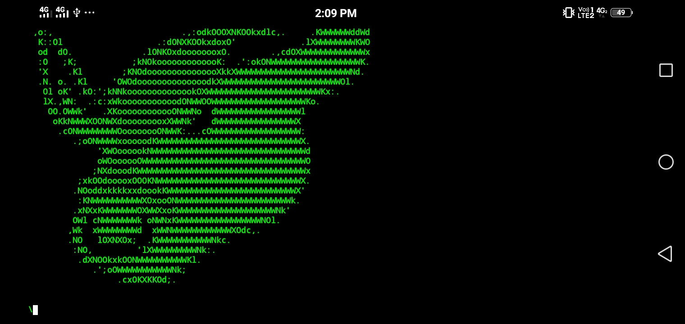

# ☣️ Beef ☣️
Hey guys Beef Tool on termux easily install and use Without 'Root'

# Beef Tool
The Beef Tool in a browser exploitation tool and It a Pentesting tool ...


    


# ⚠️ This Tool Test On 
This tool only works on Termux 
if you want to use On PC 
Go To  beef website
-  👍 https://beefproject.com/


# 🛑 Installion and Requirements 🛑

```bash
apt-get install git -y
```
```bash
git clone https://github.com/Dark-Legends/Beef.git
```

```bash
cd Beef
```

```bash
chmod +x Setup-beef.sh
```

```bash
./Setup-beef.sh
```

- And Setuping Go To Home Directory ok 👇
- And Run ./Beef.sh The Script will install On Your Termux 👇 

```bash
./Beef.sh
```
